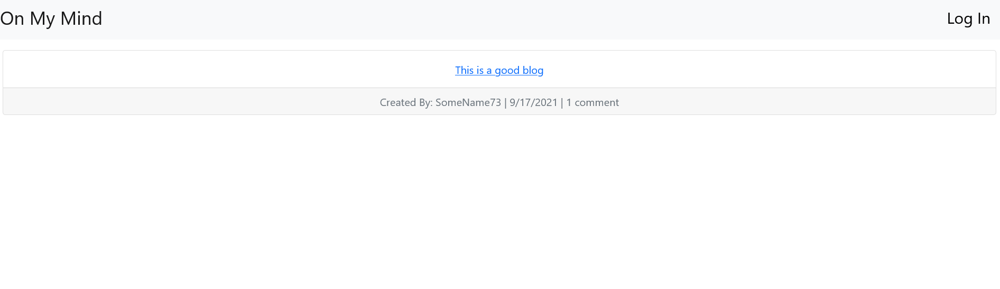
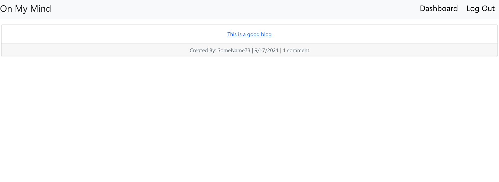

# On My Mind

## Description

On My Mind is the framework for a blogging site. This site has basic comment and post functionality as well as the ability for anyone to sign up and post or comment on other people's post. You can visit the website [here](https://on-my-mind-blog.herokuapp.com/).

## Table of Contents

* [Usage](#usage)
* [Screenshots](#screenshots)
* [License](#license)
* [Languages/Frameworks](#languages)

## Usage

On My Mind is a cms framework for a blogging site. It can be accessed by following the above link. Once there you will be presented with a homepage that contains all of the things that have been posted. In the nav bar you will be given a link to login if you haven't already done so. After signing up or logging in you will be taken to a dashboard where you can create new post or view the posts that you have created. When clicking on any post you will be given the chance to comment on the post. If you click on one of your posts you will be given the opportunity to update or delete the post in question. The session is also deleted after 15 minutes and requires the user to log back on. The website title also doubles as the homepage.

## Screenshots

## License

This project is licensed under the [MIT](LICENSE) license.

## Languages

* HTML
    * Handlebars
* CSS
    * Bootstrap
* Javascript
    * Node
    * Express
